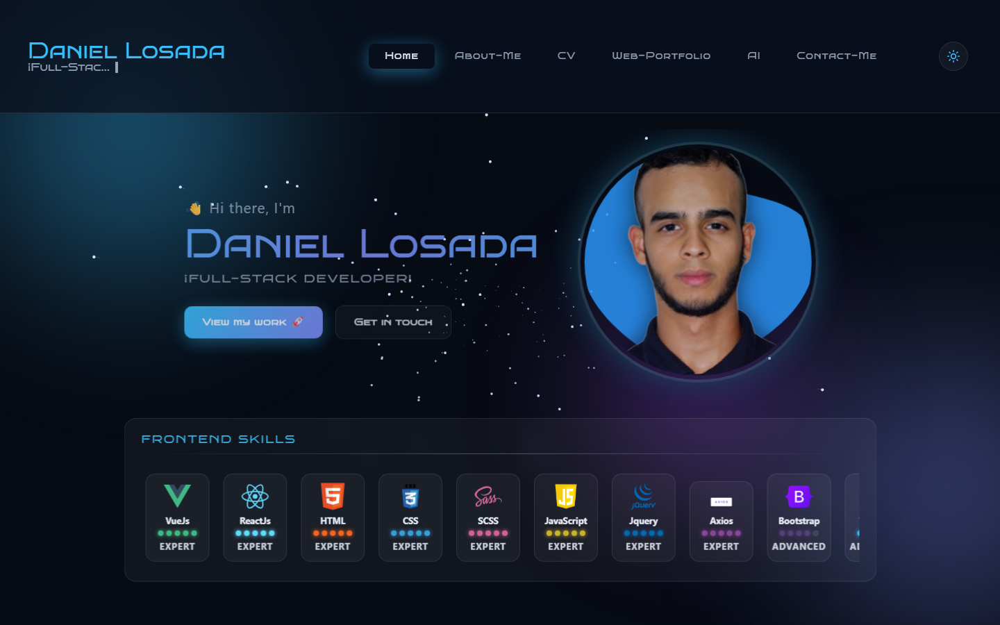
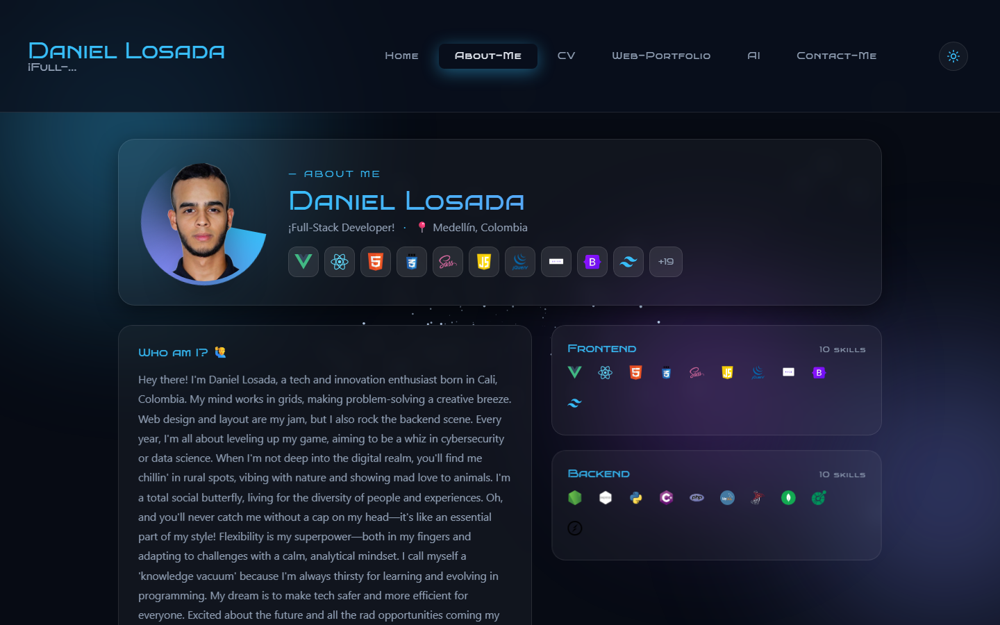
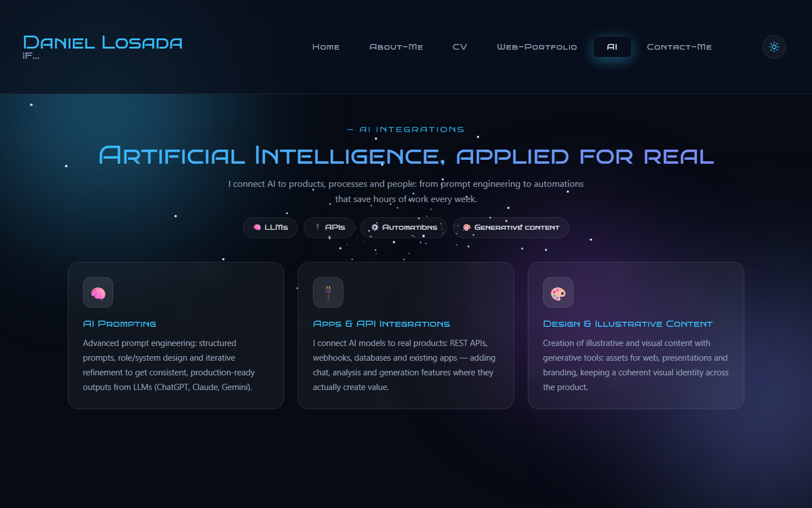
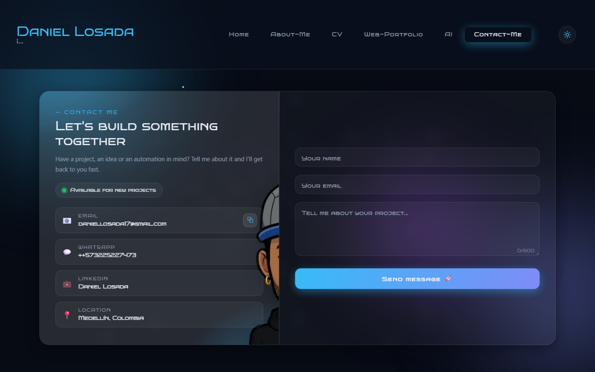
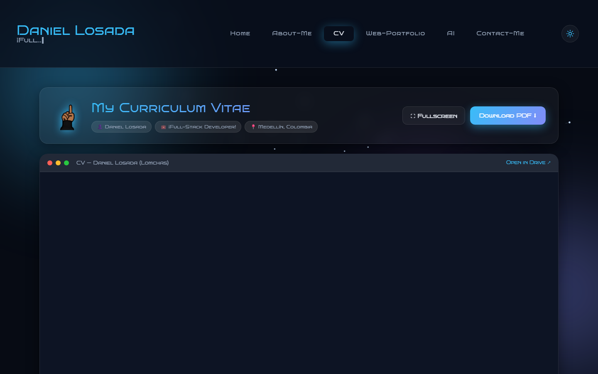

# 🚀 Daniel Losada — Full-Stack Portfolio

> 👨‍💻 Modern, animated, 3D-feel portfolio built with **Vue 3 + Vite + Sass**. Features dark/light themes, an animated starfield background, AI integrations section and a fully responsive design.

## 📖 Table of Contents
- [✨ Features](#-features)
- [🖼️ Screenshots](#️-screenshots)
- [🧠 Tech Stack](#-tech-stack)
- [💪 Skills](#-skills)
- [🧰 Experience](#-experience)
- [📞 Contact](#-contact)

## ✨ Features
- 🌗 **Dark / Light theme** — persistent, system-aware, smooth transitions
- 🌌 **Animated 3D starfield background** (canvas particle projection) + aurora orbs
- 🃏 **3D tilt profile card** that follows the mouse (Home hero)
- 📊 **Skill level system** — 5-dot levels with honest labels (Expert, Advanced…) instead of fake percentages
- 🙋 **Modern About-Me** — photo with rotating gradient ring, tech chips, dynamic skill-area cards
- 🧠 **AI Integrations module** — prompting, apps & API integrations, generative content and automations (proven experience at **Renault Sofasa Colombia**)
- 📄 **CV viewer** — macOS-style document frame, fullscreen mode, quick download
- ✉️ **Modern contact experience** — availability badge, copy-email button, floating labels, live validation, CSS spinner
- 📱 **Fully responsive** — dedicated layouts for tablet and mobile with a compact burger menu
- ⚡ Lazy-loaded routes, `prefers-reduced-motion` support, no external UI libraries

## 🖼️ Screenshots

| Home (3D hero + skills) | About Me |
|---|---|
|  |  |

| AI Integrations | Contact Me |
|---|---|
|  |  |

| CV Viewer |
|---|
|  |

## 🧠 Tech Stack
- **Framework**: Vue 3 (Composition API, `<script setup>`)
- **Bundler**: Vite 7
- **Styling**: Sass (SCSS), CSS custom properties design tokens, glassmorphism
- **Routing**: Vue Router 4 (lazy routes + page transitions)
- **HTTP**: Axios
- **Icons & assets**: devicon CDN, custom illustrations
- **Deploy**: Vercel — [Live demo](https://portfolio-daniellosada.vercel.app/)

## 💪 Skills
- **Frontend**: HTML, CSS/SCSS, JavaScript, Vue.js, React.js, Tailwind, Bootstrap
- **Backend**: Node.js, Express.js, Python, PHP, C#
- **Databases**: MySQL, MongoDB, SQL Server
- **AI**: LLM prompting, OpenAI/Gemini API integrations, process automation
- **DevOps**: Git, Vercel, Railway, Google Cloud, Azure

## 🧰 Experience
- **ATHMOS SAS** — Front-end Developer (2022)
- **Renault Sofasa Colombia** — AI-driven process automation experience (administrative & industrial)

## 📞 Contact
- Email: **daniellosada17@gmail.com**
- LinkedIn: [Daniel Losada](https://www.linkedin.com/in/daniel-losada17/)
- GitHub: [Lomchas](https://github.com/Lomchas)
- Website: [portfolio-daniellosada.vercel.app](https://portfolio-daniellosada.vercel.app/)

---

Thank you for visiting! If you have any questions or would like to discuss an opportunity, feel free to reach out. 🚀

---

# 🇪🇸 Español

# 🚀 Portafolio Full-Stack — Daniel Losada

> 👨‍💻 Portafolio moderno y animado construido con **Vue 3 + Vite + Sass**: temas claro/oscuro, fondo de estrellas 3D, módulo de integraciones con IA y diseño 100% responsivo.

## ✨ Características
- 🌗 **Tema claro / oscuro** persistente, con detección del sistema
- 🌌 **Fondo de estrellas 3D animado** (proyección de partículas en canvas) + orbes aurora
- 🃏 **Tarjeta de perfil con tilt 3D** que sigue al ratón
- 📊 **Sistema de niveles de skills** — 5 puntos + etiquetas honestas (Expert, Advanced…) en lugar de porcentajes falsos
- 🙋 **About-Me moderno** — foto con anillo giratorio, chips de tecnologías y tarjetas por área
- 🧠 **Módulo de Integraciones con IA** — prompting, integración con apps/APIs, contenido generativo y automatizaciones (experiencia comprobable en **Renault Sofasa Colombia**)
- 📄 **Visor de CV** con marco tipo documento, pantalla completa y descarga rápida
- ✉️ **Contacto moderno** — badge de disponibilidad, copiar email, labels flotantes y validación en vivo
- 📱 **Totalmente responsivo** con menú hamburguesa compacto

## 🖼️ Capturas
Ver sección [Screenshots](#️-screenshots) arriba.

## 📞 Contacto
- Email: **daniellosada17@gmail.com**
- LinkedIn: [Daniel Losada](https://www.linkedin.com/in/daniel-losada17/)
- GitHub: [Lomchas](https://github.com/Lomchas)
- Sitio web: [portfolio-daniellosada.vercel.app](https://portfolio-daniellosada.vercel.app/)

¡Gracias por visitar mi portafolio! 🚀
